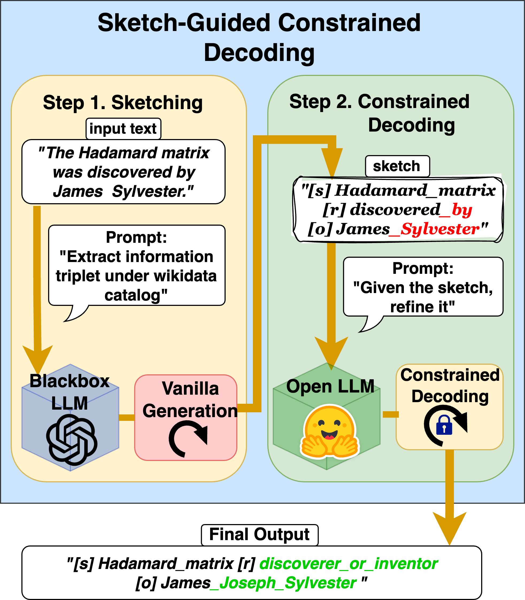

[](https://www.python.org/downloads/release/python-390/)
[](LICENSE)
[](https://arxiv.org/abs/2401.09967)


# SketchGCD: Sketch-Guided Constrained Decoding for Boosting Blackbox Large Language Models without Logit Access

---

> Leverage **powerful blackbox LLM** to generate high quality sketch and correct the sketch with a **small open-source LLM** using constrained decoding.

## 1. The Overview of SketchGCD

<div align="center">

</div>


## 2. Environment Setup

With the repository cloned, we recommend creating a new [conda](https://docs.conda.io/en/latest/) virtual environment:
```bash
conda create -n SketchGCD python=3.9
conda activate SketchGCD
```

Install the required packages:
```bash
pip install -r requirements.txt
```

## Download Knowledge Graph Data

At the root of the repository, run the following command to download the data files
```bash
git lfs install
git clone https://huggingface.co/datasets/Saibo-creator/SketchGCD-KG
mv SketchGCD-KG constraints/KG
```

## Constraints

The constraints are provided in the `constraints` directory.
Two types of constraints are used in the paper:
- **constituency parsing**: constraints are expressed as a [context-free grammar](constraints/ebnf_grammar/cp_v0.4.ebnf) which is used to guide the decoding process with [transformers-cfg](https://github.com/epfl-dlab/transformers-CFG) library.
- **closed information triplet extraction**: constraints are expressed as prefix-tree based [custom constraint](src/constrained_generation/trie_constraint.py).


## Dataset

The datasets used in the paper are:
- **Closed Information Triplet Extraction**:
	- `wikinre`: a dataset for closed information triplet extraction from Wikipedia, available at https://huggingface.co/datasets/Saibo-creator/wiki-nre
	- `synthie`: a synthetic dataset for closed information triplet extraction, available at https://huggingface.co/datasets/Saibo-creator/synthie
- **Constituency Parsing**:
	- `penn treebank`: a dataset for constituency parsing, available at https://huggingface.co/datasets/Saibo-creator/ptb

In addition, we also provide the **sketches** generated by the blackbox LLMs for the experiments in the paper.

- sketches for wikinre: https://huggingface.co/datasets/Saibo-creator/wikinre-LLM-sketch
- sketches for synthie: https://huggingface.co/datasets/Saibo-creator/synthie-LLM-sketch
- sketches for ptb: https://huggingface.co/datasets/Saibo-creator/ptb-LLM-sketch

Each sketch dataset contains 8 splits, corresponding to the 8 different LLMs' unconstrained decoding outputs.
- `GPT4`
- `GPT3.5`
- `Claude`
- `Claude-Instant`
- `LLAMA2-70B`
- `LLAMA2-13B`
- `LLAMA2-7B`
- `LLAMA-33B`


N.B. The datasets will be automatically downloaded when running the experiments scripts. You don't need to download them manually.

## Repo Structure

The repository is structured as follows:
- `assets`:
	- `prompters`: contains the prompter configurations for the experiments
	- `output`: contains the outputs of the experiments
- `constraints`: contains the constraints used in the paper
- `src`: contains the source code for the models and experiments
	- `constrained_generation`: contains the code for the constrained generation
	- `models`: contains the code for the models
	- `utils`: contains the utility functions
	- `datamodule`: contains the data module for the datasets
	- `metrics`: contains the metrics for the experiments
- `scripts`: contains the scripts for running the experiments
	- `exp_unconstrained_decoding`: contains the scripts for the unconstrained decoding experiments
	- `exp_constrained_decoding`: contains the scripts for the constrained decoding experiments
	- `exp_sketch_constrained_decoding`: contains the scripts for the sketch-guided constrained decoding experiments
	- `ablation_study_beam_size`: contains the scripts for the ablation study on beam size
	- `ablation_study_many_decoder_sizes`: contains the scripts for the ablation study on decoder model size
	- `ablation_study_no_origin_input`: contains the scripts for the ablation study without providing the origin input in the sketch [Not included in the final paper, only for debugging]
	- `ablation_study_label_as_sketch`: contains the scripts for the ablation study by using the ground truth label as the sketch [Not included in the final paper, only for debugging]
	- `analyse_results`: contains the scripts for analysing the results by computing confidence intervals
	- `prepare_datasets`: contains the scripts for preparing the datasets
	- `prepare_prompts`: contains the scripts for building the prompts for the experiments
- `test`: contains some basic unit tests for the code


## Experiments

THere are two tasks in the paper: **closed information triplet extraction** and **constituency parsing**.

The three datasets used in the paper are:
- Closed Information Triplet Extraction: `wikinre` and `synthie`
- Constituency Parsing: `penn treebank`

There are three different settings for the experiments:
- unconstrained decoding
- constrained decoding
- sketch-guided constrained decoding


For all flags and options, please refer to the `scripts/run_experiment.py`


### Unconstrained Decoding

This is the vanilla setting where we few-shot prompt an LLM to generate the output.

To run the unconstrained decoding experiments, use the following scripts:
```bash
bash scripts/exp_unconstrained_decoding/run_cp_unconstrained.sh
bash scripts/exp_unconstrained_decoding/run_synthie_unconstrained.sh
bash scripts/exp_unconstrained_decoding/run_wikinre_unconstrained.sh
```


### Constrained Decoding

This is the setting where we use the constrained decoding to guide the decoding process of the LLM.

To run the constrained decoding experiments, use the following scripts:
```bash
bash scripts/exp_constrained_decoding/run_cp_constrained.sh
bash scripts/exp_constrained_decoding/run_synthie_constrained.sh
bash scripts/exp_constrained_decoding/run_wikinre_constrained.sh
```


### Sketch-Guided Constrained Decoding

Sketch-Guided Constrained Decoding is the main contribution of the paper.
It consists of two steps:
1. Generate a sketch using a powerful blackbox LLM
2. Correct the sketch using a small open-source LLM with constrained decoding

In order to generate the sketch, just reuse the same code as in the unconstrained decoding setting.
The sketch is then used as the input for the small open-source LLM with constrained decoding.

In order to avoid calling api repeatedly, we provide the generated sketches for the experiments in the paper, which can be downloaded from the links provided above.

To run the sketch-guided constrained decoding experiments, use the following scripts:
```bash
bash scripts/exp_sketch_constrained_decoding/run_cp_SGCD.sh
bash scripts/exp_sketch_constrained_decoding/run_synthie_SGCD.sh
bash scripts/exp_sketch_constrained_decoding/run_wikinre_SGCD.sh
```


## Citation

This repository contains the code for the models and experiments in [Sketch-Guided Constrained Decoding for Boosting Blackbox Large Language Models without Logit Access](https://arxiv.org/abs/2401.09967)

```
@misc{geng2024sketchguidedconstraineddecodingboosting,
      title={Sketch-Guided Constrained Decoding for Boosting Blackbox Large Language Models without Logit Access},
      author={Saibo Geng and Berkay Döner and Chris Wendler and Martin Josifoski and Robert West},
      year={2024},
      eprint={2401.09967},
      archivePrefix={arXiv},
      primaryClass={cs.CL},
      url={https://arxiv.org/abs/2401.09967},
}
```
**Please consider citing our work, if you found the provided resources useful.**<br>


### License
This project is licensed under the terms of the MIT license.
